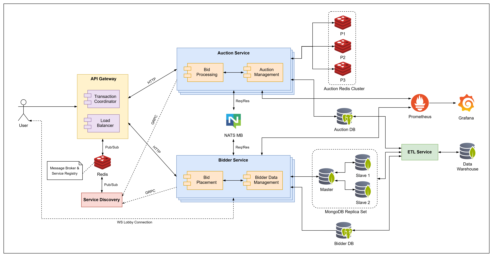

# BidBlaze

Interactive bidding platform for fast and competitive auctions.

## Application Suitability

### Why microservices are a good fit?

The growing demand for bidding platform in online marketplaces, competitive pricing models, and the engaging, real-time nature of auctions, makes bidding platforms highly popular.

Implementation through distributed systems is necessary due to following reasons:

- Scalability
- Modularity
- Maintainability
- Deployment & Fault Isolation

### Real-world example: eBay

eBay's bidding platform lets sellers list items and buyers place bids. Transitioning to microservices enabled them to handle high bid volumes, support millions of users, and maintain the system with ease.

## Setup & Run

### 1. Configure Environment Variables

For each service, follow these steps to set up environment variables:

1. In the root folder of each service, locate the `.env.example` file (e.g., `./auction-service/.env.example`).
2. Create a new file named `.env.local` in the same directory.
3. Copy the contents of `.env.example` into `.env.local` and fill in the required parameters.

Example for Auction Service (`./auction-service/.env.local`):

```shell
POSTGRES_USER=hp
POSTGRES_PASSWORD=1
POSTGRES_HOST=db-auction
POSTGRES_PORT=5432
POSTGRES_DB=auction_service
CACHE_TTL=30
REDIS_HOST_1=redis-1
REDIS_PORT_1=6379
REDIS_HOST_2=redis-2
REDIS_PORT_2=6379
REDIS_HOST_3=redis-3
REDIS_PORT_3=6379
APP_HOST=localhost
APP_PORT=3000
APP_REQ_TIMEOUT=6000
SERVICE_REGISTRY_GRPC_URL=service-discovery:50051
NATS_HOST=nats-server
NATS_PORT=4222
```

Repeat this for all services. Only change parameters marked with `...` if necessary. Adjusting these fields may require updates to `docker-compose.prod.yml`.

### 2. Run the Project

To start the project with Docker Compose, use the `run.sh` script:

1. Grant execution permission to `run.sh`:

```shell
chmod +x run.sh
```

2. Run the script:

```shell
./run.sh
```

This script builds the Docker images, starts the containers, and registers the Auction and Bidder services in Service Discovery.

If service registration does not complete, you can use `restart.sh` to repeat the process:

1. Grant execution permission to `restart.sh`:

```shell
chmod +x restart.sh
```

2. Run the script:

```shell
./restart.sh
```

This will reattempt the service registration.

### 3. Run Tests

Beforehand, navigate to the `./bidder-service` directory and install necessary dependencies:

```shell
npm install
```

To execute unit tests, run:

```shell
npm run test
```

### 4. Looby Connectivity

To connect to an auction lobby, first obtain the connection URL. You can get this URL either when an auction is created via `POST /auction` or by retrieving an auction's details with `GET /auctions/{auction_id}`.

For example, via `GET /auctions/1` endpoint:

```json
{
  "id": 1,
  "name": "Magic Apple Auction",
  ...
  "lobbyWsUrl": "ws://localhost:7002/auctions/1/lobby",
  ...
}
```

Copy the `lobbyWsUrl` and use it to initialize your client connection. Upon connecting for the first time, you should receive an `auctionUpdate` message, indicating a successful connection. From there, you will continue to receive auction updates seamlessly.

## System Design



- **Auction Service**: Handles backend logic for managing auctions, processing bids, and ensuring the auction process runs correctly.

- **Bidder Service**: Manages bidder interactions, including placing bids, receiving real-time auction updates, and tracking bid-related activities.

- **API Gateway**: Acts as the entry point for all client requests, routing traffic to the appropriate microservices.

- **Service Discovery**: Keeps track of available services and their instances to allow the API Gateway to route requests to the appropriate instances.

New features:

- Integrate Prometheus and Grafana for effective service logging and monitoring.
- Implement a Transaction Coordinator in the API Gateway to handle 2PC and long-running transaction mechanisms, ensuring safe and atomic creation of auctions and their lobbies in the Bidder Service.
- Add a Data Warehouse for in-depth analysis of auctions, bids, bidders, and their activity.
- Set up a MongoDB cluster with three replicas (one master for read and write, and two read-only followers) to ensure redundancy and failover via customized configurations.
- Deploy a Redis cluster in the auction service for sharded caching of user data, utilizing consistent hashing for efficient data distribution.

## Technology Stack & Communication Patterns

<table>
    <thead>
        <tr>
            <th>Service</th>
            <th>Technology Stack</th>
        </tr>
    </thead>
    <tbody>
        <tr>
            <td>Auction Service</td>
            <td>Nest.js (TypeScript) + PostgreSQL + Redis</td>
        </tr>
        <tr>
            <td>Bidder Service</td>
            <td>Nest.js (TypeScript) + PostgreSQL + MongoDB</td>
        </tr>
        <tr>
            <td>API Gateway</td>
            <td rowspan=2>Flask (Python) + Redis</td>
        </tr>
        <tr>
            <td>Service Discovery</td>
        </tr>
    </tbody>
</table>

Inter-service communication:

- API Gateway - services: RESTful APIs over HTTP/1.1
- Service Discovery - services: HTTP/1.1, gRPC over HTTP/2;
- User-lobby communication: WebSocket over TCP.
- Auction Service - Bidder Service: Request/Response with NATS as message broker
- API Gateway - Service Discovery: Pub/Sub with Redis as message broker

## Data Management

### Data Models

#### Auction

| Name              | Type    | Description                                            |
| ----------------- | ------- | ------------------------------------------------------ |
| id                | integer | Unique ID for the auction (PK)                         |
| name              | string  | Name of the auction                                    |
| sellerId          | string  | ID of the seller (FK)                                  |
| startTimestamp    | string  | Auction start time                                     |
| endTimestamp      | string  | Auction end time                                       |
| status            | enum    | Status of the auction (`CREATED`, `RUNNING`, `CLOSED`) |
| winnerId          | string  | ID of the winner                                       |
| winnerFinalAmount | double  | Winning bid amount                                     |

#### Item

| Name         | Type    | Description                               |
| ------------ | ------- | ----------------------------------------- |
| id           | integer | Unique ID for the item (PK)               |
| name         | string  | Item name                                 |
| reservePrice | double  | Minimum price required to win the auction |
| currency     | string  | Currency used for the auction             |

#### Bid

| Name      | Type      | Description                                     |
| --------- | --------- | ----------------------------------------------- |
| id        | integer   | Unique ID for the bid (PK)                      |
| auctionId | integer   | ID of the auction where the bid was placed (FK) |
| bidderId  | string    | ID of the bidder (FK)                           |
| amount    | double    | The bid amount                                  |
| timestamp | timestamp | Time when the bid was placed                    |

#### Bidder

| Name  | Type   | Description                   |
| ----- | ------ | ----------------------------- |
| id    | string | Unique ID for the bidder (PK) |
| name  | string | Name of the bidder            |
| email | string | Email of the bidder           |

#### Lobby

| Name       | Type    | Description                  |
| ---------- | ------- | ---------------------------- |
| id         | integer | Unique ID for the lobby (PK) |
| auctionId  | string  | ID of the auction (FK)       |
| lobbyWsUrl | string  | WebSocket connection URL     |

### API Specification

#### Auction Service

1. `POST /auctions` - create a new auction.

   Request (JSON):

   ```json
   {
     "name": "string",
     "sellerId": "string",
     "startTimestamp": "timestamp",
     "durationMinutes": "integer",
     "item": {
       "name": "string",
       "reservePrice": "double",
       "currency": "string"
     }
   }
   ```

   Response (JSON):

   ```json
   {
     "auctionId": "integer",
     "lobbyWsUrl": "string",
     "message": "Auction created successfully"
   }
   ```

2. `GET /auctions` - retrieve a list of all auctions

   Response (JSON):

   ```json
   [
     {
       "id": "integer",
       "name": "string",
       "sellerId": "integer",
       "startTimestamp": "timestamp",
       "endTimestamp": "timestamp",
       "status": "enum",
       "winnerId": "string",
       "winningFinalAmount": "double",
       "item": {
         "id": "integer",
         "name": "string",
         "reservePrice": "double",
         "currency": "string"
       }
     }
   ]
   ```

3. `GET /auctions/{auction_id}` - retrieve details of a specific auction

   Response (JSON):

   ```json
   {
     "id": "integer",
     "name": "string",
     "sellerId": "integer",
     "startTimestamp": "timestamp",
     "endTimestamp": "timestamp",
     "status": "enum",
     "winnerId": "string",
     "winningFinalAmount": "double",
     "item": {
       "id": "integer",
       "name": "string",
       "reservePrice": "double",
       "currency": "string"
     },
     "lobbyWsUrl": "string",
     "bids": [
       {
         "id": "integer",
         "bidderId": "string",
         "amount": "double",
         "timestamp": "timestamp"
       }
     ]
   }
   ```

4. `PATCH /auctions/{auction_id}/close` - close an auction and determine the winner

   Response (JSON):

   ```json
   {
     "auctionId": "integer",
     "winnerId": "string",
     "finalPrice": "double",
     "message": "Auction closed successfully"
   }
   ```

5. `DELETE /auctions/{auction_id}` - delete a specific auction

   Response:

   ```json
   {
     "message": "Auction with ID {auction_id} removed successfully."
   }
   ```

6. `GET /health` - check the health status of the Auction Service

   Response (JSON):

   ```json
   {
     "status": "ok",
     "info": {
       "redis": {
         "status": "up"
       },
       "database": {
         "status": "up"
       }
     },
     "error": {},
     "details": {
       "redis": {
         "status": "up"
       },
       "database": {
         "status": "up"
       }
     }
   }
   ```

#### Bidder Service

1.  `POST /bidders` - create a bidder record.

    Request (JSON):

    ```json
    {
      "name": "string",
      "email": "string"
    }
    ```

    Response (JSON):

    ```json
    {
      "name": "string",
      "email": "string",
      "_id": "string",
      "__v": "number"
    }
    ```

2.  `POST /bids` - place a bid on an auction.

    Request (JSON):

    ```json
    {
      "auctionId": "integer",
      "bidderId": "string",
      "amount": "double"
    }
    ```

    Response (JSON):

    ```json
    {
      "auctionId": "integer",
      "bidderId": "string",
      "amount": "double",
      "timestamp": "string",
      "id": "integer",
      "message": "Bid placed successfully"
    }
    ```

3.  `GET /bids/{bid_id}` - retrieve details of a specific bid

    Response (JSON):

    ```json
    {
      "id": "integer",
      "auctionId": "integer",
      "bidderId": "string",
      "amount": "double",
      "timestamp": "string"
    }
    ```

4.  `GET /bidders/{bidder_id}` - retrieve details of a specific bidder

    Response (JSON):

    ```json
    {
      "_id": "string",
      "name": "string",
      "email": "string",
      "__v": "number"
    }
    ```

5.  `GET /bidders/{bidder_id}/bids` - retrieve all bids placed by a specific bidder.

    Response (JSON):

    ```json
    [
      {
        "id": "integer",
        "auctionId": "integer",
        "bidderId": "string",
        "amount": "double",
        "timestamp": "string"
      }
    ]
    ```

6.  `GET /lobbies` - retrieve lobbies' info

    Response (JSON):

    ```json
    [
      {
        "id": "integer",
        "auctionId": "integer",
        "lobbyWsUrl": "string"
      }
    ]
    ```

7.  `PATCH /bidders/{bidder_id}` - update bidder record.

    Request (JSON):

    ```json
    {
      "name": "bob",
      "email": "bob@mail.com"
    }
    ```

    Response (JSON):

    ```json
    {
      "_id": "string",
      "name": "string",
      "email": "string",
      "__v": "number",
      "message": "Bidder with ID {bidder_id} updated successfully."
    }
    ```

8.  `PATCH /bids/{bid_id}` - update bid record.

    Request (JSON):

    ```json
    {
      "bidderId": "string",
      "amount": "double"
    }
    ```

    Response (JSON):

    ```json
    {
      "id": "integer",
      "auctionId": "integer",
      "bidderId": "string",
      "amount": "double",
      "timestamp": "string",
      "message": "Bid with ID {bid_id} updated successfully."
    }
    ```

9.  `DELETE /bidders/{bidder_id}` - delete a specific bidder

    Response:

    ```json
    {
      "message": "Bidder with ID {bidder_id} removed successfully."
    }
    ```

10. `DELETE /bids/{bid_id}` - delete a specific bid

    Response:

    ```json
    {
      "message": "Bid with ID {bid_id} removed successfully."
    }
    ```

11. `GET /health` - check the health status of the bidder service.

    Response (JSON):

    ```json
    {
      "status": "ok",
      "info": {
        "database": {
          "status": "up"
        },
        "mongodb": {
          "status": "up"
        }
      },
      "error": {},
      "details": {
        "database": {
          "status": "up"
        },
        "mongodb": {
          "status": "up"
        }
      }
    }
    ```

12. `WebSocket /auctions/{auction_id}/lobby` - join an auction lobby for real-time updates on auction progress.

    Message Sent to Client (JSON):

    ```json
    {
      "auctionId": "integer",
      "bids": [
        {
          "bidderId": "string",
          "bidPrice": "double",
          "timestamp": "string"
        }
      ],
      "remainingTime": "string",
      "status": "enum"
    }
    ```

## Deployment & Scaling

Each service, including

- Auction Service
- Bidder Service
- API Gateway
- Service Discovery
- PostgreSQL DBs
- MongoDBs
- Redis
- NATS Message Broker

will be deployed as Docker containers within a shared network managed by Docker Compose. Redis and Postgres will also run as containerized services.

Each custom service is defined with its own **Dockerfile**, ensuring that dependencies are packaged and the service runs consistently across environments.

Horizontal scaling will be applied, allowing multiple instances of each service to be deployed for load balancing and better performance.

All services are managed through docker-compose files, simplifying configuration and communication. To deploy and scale the services, I will use:

```shell
docker-compose -f docker-compose.prod.yml up -d --build
```

This builds each service from its Dockerfile and launches them in detached mode with horizontal scaling.
