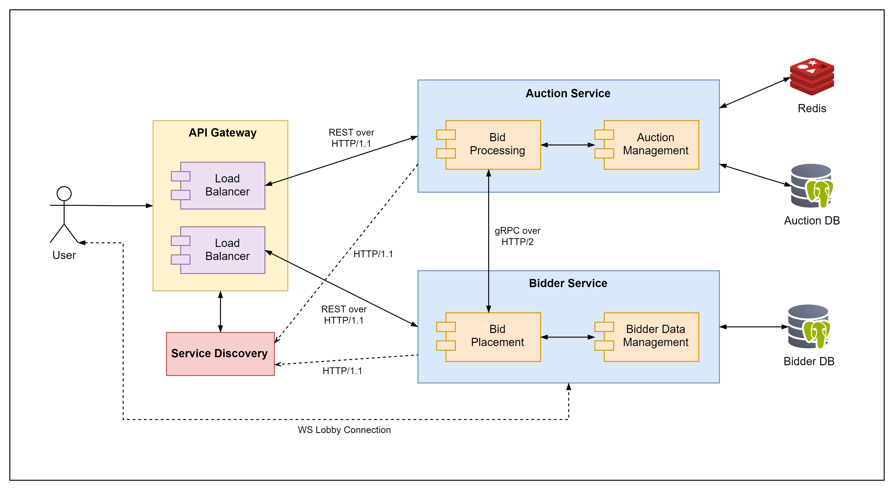

# BidBlaze

Interactive bidding platform for fast and competitive auctions.

## Application Suitability

### Why microservices are a good fit?

The growing demand for bidding platform in online marketplaces, competitive pricing models, and the engaging, real-time nature of auctions, makes bidding platforms highly popular.

Implementation through distributed systems is necessary due to following reasons:

- **Scalability**: Microservices allow key components, like bid processing, to scale independently during traffic spikes, especially near auction endings.

- **Modularity**: By decoupling functions like bidding and auctions handling into separate services, we enhance maintainability and enable teams to work independently.

- **Maintainability**: Microservices reduce the complexity of maintaining large monolithic bidding system by breaking entities into smaller, focused services.

- **Deployment & Fault Isolation**: Failures in one service don't affect others. Services can be updated or deployed separately for faster development without disrupting the entire system.

### Real-world example: eBay

eBay's bidding platform lets sellers list items and buyers place bids. Transitioning to microservices enabled them to handle high bid volumes, support millions of users, and maintain the system with ease.

## Service Boundaries



- **Auction Service**: Handles backend logic for managing auctions, processing bids, and ensuring the auction process runs correctly.

- **Bidder Service**: Manages bidder interactions, including placing bids, receiving real-time auction updates, and tracking bid-related activities.

- **API Gateway**: Acts as the entry point for all client requests, routing traffic to the appropriate microservices.

- **Service Discovery**: Keeps track of available services and their instances to allow the API Gateway to route requests to the appropriate instances.

## Technology Stack & Communication Patterns

<table>
    <thead>
        <tr>
            <th>Service</th>
            <th>Technology Stack</th>
        </tr>
    </thead>
    <tbody>
        <tr>
            <td>Auction Service</td>
            <td>Nest.js (TypeScript) + PostgreSQL + Redis</td>
        </tr>
        <tr>
            <td>Bidder Service</td>
            <td>Nest.js (TypeScript) + PostgreSQL</td>
        </tr>
        <tr>
            <td>API Gateway</td>
            <td rowspan=2>Flask (Python) + Nginx + Consul</td>
        </tr>
        <tr>
            <td>Service Discovery</td>
        </tr>
    </tbody>
</table>

- Inter-service communication: RESTful APIs over HTTP/1.1, gRPC (proto) over HTTP/2;
- User-lobby communication: WebSocket over TCP.

## Data Management

### Data Models

#### Auction Table

| Name         | Type   | Description                                            |
| ------------ | ------ | ------------------------------------------------------ |
| auction_id   | UUID   | Unique ID for the auction (PK)                         |
| auction_name | String | Name of the auction                                    |
| seller_id    | UUID   | ID of the seller                                       |
| status       | Enum   | Status of the auction (`CREATED`, `RUNNING`, `CLOSED`) |

#### Item Table

| Name          | Type    | Description                               |
| ------------- | ------- | ----------------------------------------- |
| item_id       | UUID    | Unique ID for the item (PK)               |
| auction_id    | UUID    | ID of the auction (FK)                    |
| name          | String  | Name of the item                          |
| reserve_price | Decimal | Minimum price required to win the auction |
| currency      | String  | Currency used for the auction             |

#### Bid Table

| Name       | Type      | Description                                     |
| ---------- | --------- | ----------------------------------------------- |
| bid_id     | UUID      | Unique ID for the bid (PK)                      |
| auction_id | UUID      | ID of the auction where the bid was placed (FK) |
| bidder_id  | UUID      | ID of the bidder (FK)                           |
| amount     | Decimal   | The bid amount                                  |
| timestamp  | Timestamp | Time when the bid was placed                    |

#### Bidder Table

| Name      | Type   | Description                   |
| --------- | ------ | ----------------------------- |
| bidder_id | UUID   | Unique ID for the bidder (PK) |
| name      | String | Name of the bidder            |
| email     | String | Email of the bidder           |

### API Specification

#### Auction Service

1. `GET /auctions` - retrieve a list of all auctions, with optional query filtering

   Optional Query Parameters: `?status=CREATED/RUNNING/CLOSED`

   Response (JSON):

   ```json
   [
     {
       "auction_id": "uuid",
       "auction_name": "string",
       "status": "string",
       "current_highest_bid": "decimal",
       "end_time": "timestamp"
     }
   ]
   ```

2. `GET /auctions/{auction_id}` - retrieve details of a specific auction

   Response (JSON):

   ```json
   {
     "auction_id": "uuid",
     "auction_name": "string",
     "seller_id": "uuid",
     "status": "string",
     "items": [
       {
         "item_id": "uuid",
         "name": "string",
         "reserve_price": "decimal",
         "currency": "string",
         "current_bid_price": "decimal",
         "bids": [
           {
             "bid_id": "uuid",
             "bidder_id": "uuid",
             "bid_price": "decimal",
             "timestamp": "timestamp"
           }
         ]
       }
     ]
   }
   ```

3. `POST /auctions` - create a new auction.

   Request (JSON):

   ```json
   {
     "auction_name": "string",
     "seller_id": "uuid",
     "items": [
       {
         "name": "string",
         "reserve_price": "decimal",
         "currency": "string"
       }
     ]
   }
   ```

   Response (JSON):

   ```json
   {
     "auction_id": "uuid",
     "message": "Auction created successfully"
   }
   ```

4. `PATCH /auctions/{auction_id}/close` - close an auction and determine the winner

   Response (JSON):

   ```json
   {
     "auction_id": "uuid",
     "winner_id": "uuid",
     "final_price": "decimal",
     "message": "Auction closed successfully"
   }
   ```

5. `DELETE /auctions/{auction_id}` - delete a specific auction

   Response (No Content):

   - Status code: `204 No Content`

6. `GET /health` - check the health status of the Auction Service

   Response (JSON):

   ```json
   {
     "status": "ok",
     "details": {
       "auctionService": {
         "status": "up"
       },
       "database": {
         "status": "up"
       },
       "redis": {
         "status": "up"
       }
     }
   }
   ```

7. `gRPC: SendAuctionUpdate` - send updates about the auction’s progress to Bidder Service

   Request (Protobuf):

   ```proto
   message AuctionUpdate {
     string auction_id = 1;
     repeated Bid bids = 2;
     string auction_status = 3;
     int64 remaining_time = 4;
   }

   message Bid {
     string bidder_id = 1;
     float bid_amount = 2;
   }
   ```

   Response (Protobuf):

   ```proto
   message AuctionUpdateResponse {
     string message = 1;
   }
   ```

8. `gRPC: CreateLobby` - create a WebSocket lobby in Bidder Service for a newly created auction

   Request (Protobuf):

   ```proto
   message CreateLobbyRequest {
    string auction_id = 1;
    string auction_name = 2;
   }
   ```

   Response (Protobuf):

   ```proto
   message CreateLobbyResponse {
    string status = 1;
    string message = 2;
   }
   ```

#### Bidder Service

1. `GET /bids/{bid_id}` - retrieve details of a specific bid

   Response (JSON):

   ```json
   {
     "bid_id": "uuid",
     "auction_id": "uuid",
     "item_id": "uuid",
     "bidder_id": "uuid",
     "bid_price": "decimal",
     "timestamp": "timestamp"
   }
   ```

2. `GET /bidders/{bidder_id}` - retrieve details of a specific bidder

   Response (JSON):

   ```json
   {
     "bidder_id": "uuid",
     "name": "string",
     "email": "string",
     "account_balance": "decimal"
   }
   ```

3. `GET /bidders/{bidder_id}/bids` - retrieve all bids placed by a specific bidder.

   Response (JSON):

   ```json
   [
     {
       "bid_id": "uuid",
       "auction_id": "uuid",
       "item_id": "uuid",
       "bid_price": "decimal",
       "timestamp": "timestamp"
     }
   ]
   ```

4. `POST /bids` - place a bid on an auction.

   Request (JSON):

   ```json
   {
     "auction_id": "uuid",
     "item_id": "uuid",
     "bidder_id": "uuid",
     "bid_price": "decimal"
   }
   ```

   Response (JSON):

   ```json
   {
     "bid_id": "uuid",
     "message": "Bid placed successfully"
   }
   ```

5. `GET /health` - check the health status of the Bidder Service.

   Response (JSON):

   ```json
   {
     "status": "ok",
     "details": {
       "bidderService": {
         "status": "up"
       },
       "database": {
         "status": "up"
       }
     }
   }
   ```

6. `WebSocket /auctions/{auction_id}/lobby` - join an auction lobby for real-time updates on auction progress.

   Message Sent to Client (JSON):

   ```json
   {
     "auction_id": "uuid",
     "bids": [
       {
         "bidder_id": "uuid",
         "bid_price": "decimal",
         "timestamp": "timestamp"
       }
     ],
     "remaining_time": "30 seconds",
     "status": "open"
   }
   ```

7. `gRPC: PlaceBid` - place a bid on an auction item by sending a request to the Auction Service.

   Request (Protobuf):

   ```proto
   message PlaceBidRequest {
     string auction_id = 1;
     string bidder_id = 2;
     float bid_amount = 3;
   }
   ```

   Response (Protobuf):

   ```proto
   message PlaceBidResponse {
     string bid_id = 1;
     string status = 2;
     string message = 3;
   }
   ```

### Task Timeouts

1. **API Gateway (Nginx) Timeout**

Configuring the timeout in Nginx gateway by setting the `proxy_read_timeout`, `proxy_connect_timeout`, and `proxy_send_timeout` to define how long Nginx will wait for a service to respond.

```shell
proxy_read_timeout 30s;
proxy_connect_timeout 30s;
proxy_send_timeout 30s;
```

2. **Microservices Timeout (NestJS)**

In **NestJS**, I will use the `timeout()` operator from RxJS to set a timeout for any asynchronous request. For example:

```typescript
import { timeout } from "rxjs/operators";

this.httpService.get(url).pipe(timeout(5000)); // Timeout after 5 seconds
```

3. **Database Timeout (Postgres)**

I will Configure timeout in Postgres by setting the `statement_timeout` parameter to abort queries that run longer than a specified duration.

```sql
SET statement_timeout = '5s';  -- 5 seconds timeout for queries
```

4. **Redis Timeout**

I will set timeouts in Redis commands by configuring the `timeout` parameter in Redis client.

```javascript
const client = redis.createClient({ socket: { connectTimeout: 5000 } }); // 5 seconds timeout
```

### Concurent Tasks Limit

To handle Concurrent Task Limits, I will implement concurrency control mechanism to ensure that only a certain number of tasks are executed simultaneously by limiting concurrency with using semaphores or worker pools in service to control how many tasks are processed concurrently.

In NestJS, I can use a semaphore or rate-limiter to limit the number of concurrent tasks.

Limit Concurrent HTTP Requests in NestJS:

```typescript
import { HttpService } from "@nestjs/common";
import * as pLimit from "p-limit";

const limit = pLimit(5); // Limit to 5 concurrent tasks

export class MyService {
  constructor(private readonly httpService: HttpService) {}

  async fetchMultipleUrls(urls: string[]) {
    const tasks = urls.map((url) =>
      limit(() => this.httpService.get(url).toPromise())
    );
    return await Promise.all(tasks);
  }
}
```

### Circuit Breaker

The circuit breaker for this system will be implemented using `opossum` from Node.js. This circuit breaker will remove the service when a threshold of 3 errors is reached within the window of task timeout limit \* 3.5.

```javascript
const CircuitBreaker = require('opossum');
const axios = require('axios');

const taskTimeoutLimit = 5000; // Example: 5 seconds

const options = {
  // Task timeout (5 seconds)
  timeout: taskTimeoutLimit,
  // Fail after 3 consecutive errors (since 3 errors out of 3 attempts is 100%)
  errorThresholdPercentage: 100,
  // Wait for (task timeout limit * 3.5) before trying to recover
  resetTimeout: taskTimeoutLimit * 3.5,
};
const breaker = new CircuitBreaker(() => axios.get('https://example.com'), options);

breaker.fallback(() => 'Service currently unavailable');
...
breaker.fire();

```

### Health Monitoring and Alerts

To implement **Health Monitoring and Alerts** for critical load (e.g., 60 pings per second), I'll use **Prometheus** to monitor request rates and **Alertmanager** for alerting.

- **Monitor Load with Prometheus**: Each service will expose a `/metrics` endpoint that Prometheus scrapes. It will track the number of requests per second.
- **Define Critical Load**: Set an alert rule in Prometheus that triggers when the request rate exceeds 60 pings per second.
- **Alerting with Alertmanager**: When the threshold is breached, Alertmanager will send notifications (e.g., via email or Slack) to inform the team that the load is critical.

### Load Balancing: Service Load

To implement load balancing via service load with Nginx and Python, I will configure Nginx to use the **`least_conn`** directive, which routes traffic to the instance with the fewest active connections, balancing load effectively.

Nginx config example:

```nginx
upstream my_python_services {
    least_conn;
    server 127.0.0.1:8000;
    server 127.0.0.1:8001;
}

server {
    listen 80;
    location / {
        proxy_pass http://my_python_services;
    }
}
```

For deeper load balancing, Python services can expose health metrics (e.g., via `psutil`), allowing Nginx to route traffic based on CPU or request load.

### Unit Testing

Unit tests for microservices will be written in **Jest** - popular test framework for Node.js applications.

### Health Endpoints for Gateway and Service Discovery

The status endpoints for both the Gateway and Service Discovery, I will use a simple `GET /status` endpoint that returns the current health or status of the service.

Example response (JSON):

```json
{
  "status": "up",
  "timestamp": "2024-09-17T12:00:00.000Z",
  "service": "gateway"
}
```

## Deployment & Scaling

Each service, including

- Auction Service
- Bidder Service
- API Gateway (Nginx)
- Service Discovery (Consul)

will be deployed as Docker containers within a shared network managed by Docker Compose. Redis and Postgres will also run as containerized services.

Each custom service is defined with its own **Dockerfile**, ensuring that dependencies are packaged and the service runs consistently across environments.

Horizontal scaling will be applied, allowing multiple instances of each service to be deployed for load balancing and better performance.

All services are managed through a single `docker-compose.yml` file, simplifying configuration and communication. To deploy and scale the services, I will use:

```shell
docker-compose up -d --build
```

This builds each service from its Dockerfile and launches them in detached mode with horizontal scaling.
